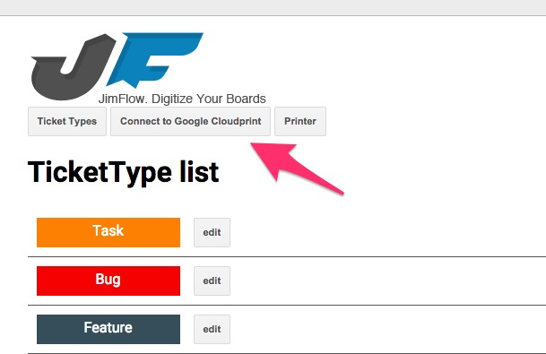
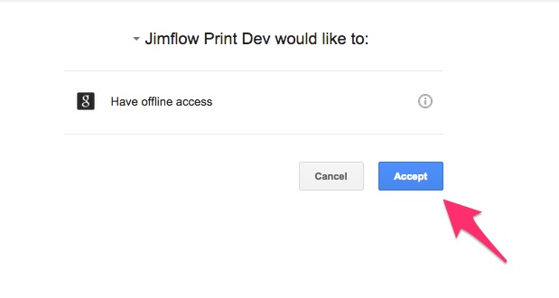
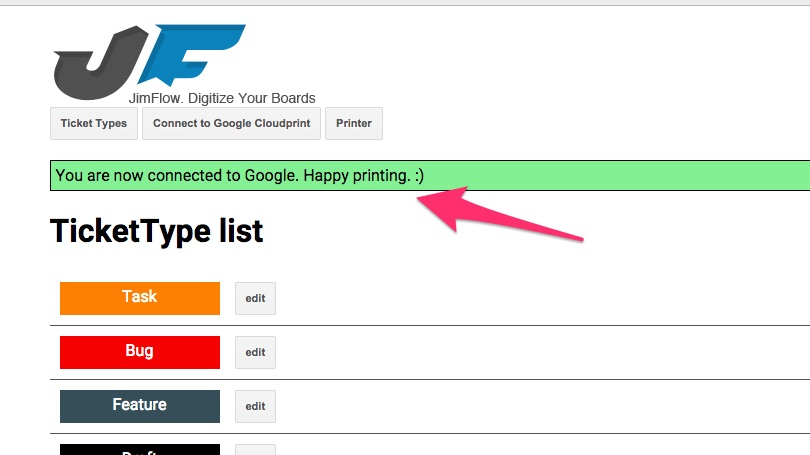
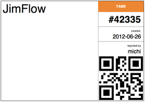
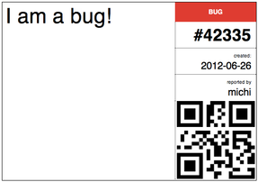
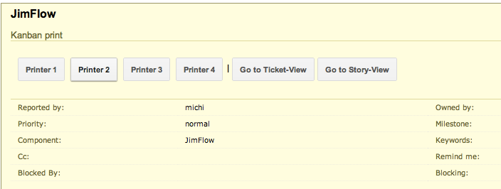
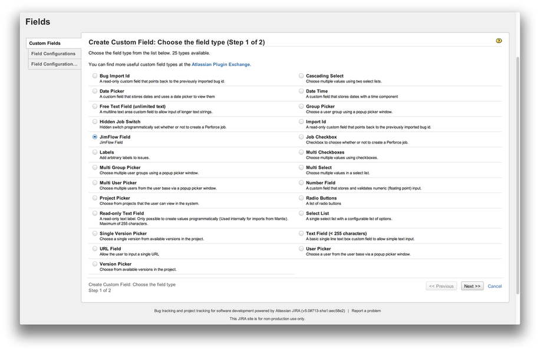
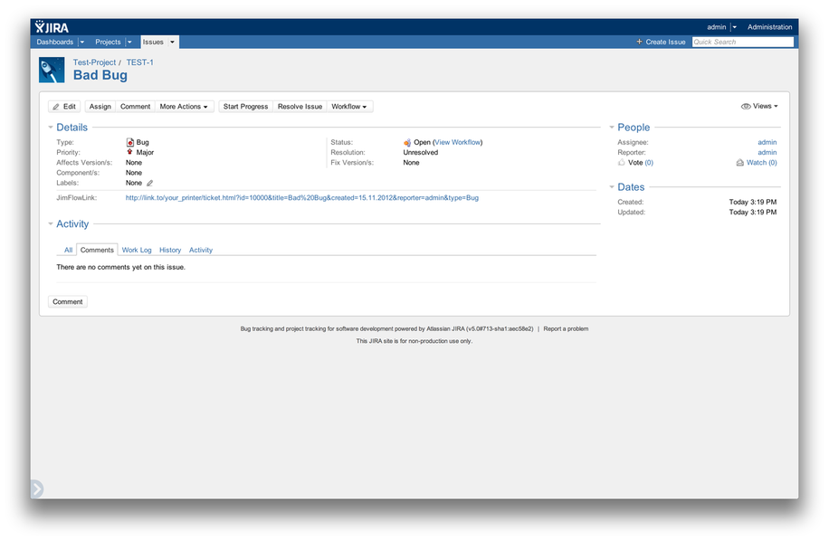
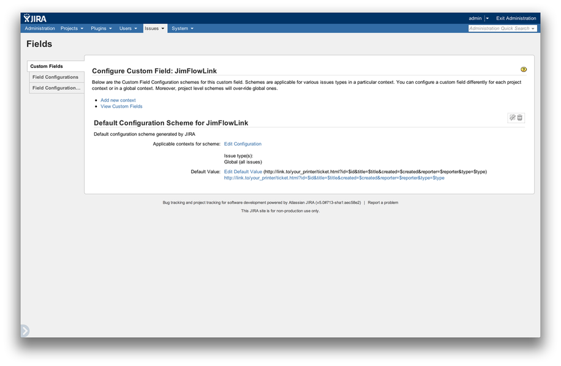

JimFlowPrint is a component of JimFlow

see http://jimflow.jimdo.com for more information.

## Updated for networkteam Kanban boards

Implement CUPS printer driver and some enhancements.

Note: Update assets in production

* php app/console assets:install web/ --env=prod
* php app/console assetic:dump --env=prod

Another Note: Due to issues with wkhtmltopdf >= 0.12.4 regarding full page scaling, an installation of wkhtmltopdf version 0.12.3 is recommended.

-----

JimFlowPrint enables you to print your tickets out of your issue tracking system with just one click, using the [Google Cloud Print](http://www.google.com/cloudprint/learn/) API.

If you need any help e.g. with embedding the print buttons into your ticket system, head to: [https://groups.google.com/forum/?fromgroups#!forum/jimflow](https://groups.google.com/forum/?fromgroups#!forum/jimflow)

## Setup

### Requirements

 - webserver, configured to meet symfony2 requirements (Apache / Nginx)
 - cURL
 - MySql
 - git
 - [wkhtmltopdf](http://wkhtmltopdf.org/) 0.12
 - a Google account for [managing the printers](http://www.google.com/cloudprint/learn/)
 - Google Cloud Print Ready printer configured (currently only Epson printers are supported e.g. Epson Stylus SX440W (slow) / Epson WP 4025 (little bit faster)
 - A6 paper
 - php.ini: remove proc_open from disable_functions
 
 
 
### !! Google account !!

Since April 2015 JimflowPrint communicates with Google using oauth. Therefore you'll have to setup a Client ID with your Google account. 

Create a project in the [Google Developer Console](https://console.developers.google.com/).
Head to the `APIs & auth -> Credentials` section and create a new client id.

Select  `Web application` as `Application type`.

You need to configure `Authorized redirect URIs` to include
```
http://{your_host}/web/app.php/admin/oauth/oauth2callback
http://{your_host}/admin/oauth/oauth2callback
```
`Authorized JavaScript origins` should be `http://{your_host}/`.

After succesfully setting up the client id, Google will provide you a Client ID and a Client secret. Those two values will be needed later in the setup process.

More Info can be found [here](https://developers.google.com/console/help/new/#generatingoauth2).


### Installation
You can install the application with any configuration management tool you prefer. Below you can find an example of manual steps needed to get Jimflow Print up and running on a linux macnine.

Go to your webservers root directory and run following commands:

Clone the github repository:

```
git clone git://github.com/Jimdo/JimFlowPrint.git

```

Move the application to the directory:

```
shopt -s dotglob nullglob
mv JimFlowPrint/* .
rm -rf JimFlowPrint/
```

Install composer

```
curl -s http://getcomposer.org/installer | php

php composer.phar install
```

Prepare Symfony:

```
./bin/build_bootstrap
mkdir app/cache app/logs
```

Check for potential symfony2 errors and [requirements](http://symfony.com/doc/2.3/reference/requirements.html)

```
php app/check.php
```

Configure Symfony

```
cp app/config/parameters.example.ini app/config/parameters.ini
cp app/config/config_prod.yml.dist app/config/config_prod.yml
```

Now enter all required parameters in `parameters.ini`. The above mentioned Google Client ID and Client secret are in here for example.
See the comments above each parameter for more information. 
You can also make adjustments to `config_prod.yml`, to e.g. add another logging component, but you should be fine with the default at the start.


Create the database and the tables

```
php app/console doctrine:database:create
php app/console doctrine:migrations:migrate
```

Install assets (Javascript/CSS files)

```
php app/console assets:install --symlink web/
php app/console assetic:dump
```

Clear the cache

```
php app/console cache:clear --env=prod
```

### App Setup

#### Connect to Google

Go to `http://{hostname}/web/app.php/admin/tickettype/` and click on `Connect to Google Cloudprint`, while logged into the account where the Google Cloud Print printers are configured, to start the Google connection process.




If you see this success message afterwards, you should be ready to go.
Goto `http://{your_hostname}/web/app.php/template/ticket.html?title=it%20works` to print your first ticket.


#### Ticket Types



Ticket types specify the color which gets printed in the upper right of the ticket so that they can easily be differentiated.

Login into the Ticket Type administration with the username and password you've configured in the `app/config/parameters.ini` during the installation.

`http://{hostname}/web/app.php/admin/tickettype/`
 
Now you can add Ticket Types with a specified color. The name is the Ticket Type name which gets submitted by the Issue Tracking System. You can also specify a color for unknown Ticket Type names if you activate the option "Use if no or unknown type is specified?".
If you activate the option "Fill entire background", the entire right area will be filled up by this color.

### Incorporate into Issue Tracking System
You can embed the print buttons in any page to be able to print tickets without leaving your ticket system.
Below you find examples on how to embed print buttons into Jira and Trac.

#### Trac
Open the ticket.html template of your trac installation.
e.g.:

```
/usr/lib/python2.6/dist-packages/trac/ticket/templates/ticket.html
```

Before
```
<table class="properties"
                 py:with="fields = [f for f in fields if not f.skip and f.name
                                    not in ('type', 'owner')]">
            <tr>
              <th id="h_reporter">Reported by:</th>
```

insert:
```
<!-- create Kanban card from ticket data-->
<div class="description">
    <h3 id="comment:description">Kanban print</h3>
    <div class="jim-print-buttons" 
        data-id="T${ticket.id}" 
        data-reporter="${authorinfo(ticket.reporter)}" 
        data-title="${quote_plus(ticket.summary)}" 
        data-created="${dateinfo(ticket.time_created)}" 
        data-type="${ticket.type}" 
        data-style="width: 100%; height: 65px; border: none;">
    </div>
</div>
```

before closing </body> tag insert:

```
<script type="text/javascript">
   (function(d, tagName) {
       var js = d.createElement(tagName), ins;
       js.type = 'text/javascript';
       js.async = true;
       js.src = 'http://{your_host}/buttons/loader.js';

       ins = d.getElementsByTagName(tagName)[0];
       ins.parentNode.insertBefore(js, ins);
   })(document, 'script')
</script>
```
replace the js.src {your_host} with your server hostname
Now when you open up a ticket, the buttons will show up like the example below. Click a button and the selected ticket will be printed on the selected printer.



#### Jira
The JimFlow Jira Plugin can be downloaded [here](http://jimflow.jimdo.com/setup-jimflowprint/include-into-issue-tracking-system/jira/). The source code is available at [it-agile/JimFlowJira](https://github.com/it-agile/JimFlowJira). After installing the JimFlow Jira Plugin via `Upload Plugin` in the plugins menu, you can add a new custom field of the type JimFlow Field.



This is a custom URL field, in which the placeholders “$id”, “$title”, “$created”, “$reporter” and “$type” will be replaced with the actual values from the issue. Clicking on the generated link creates a printable QR code for the issue.



It makes sense to enter the link with the placeholders as a system- or project-wide default for the JimFlow Field. This way, you won’t have to enter the link every time you create a new issue. This can be done via the “Set Custom Field Defaults” menu.




## Local Development

The following setup is not meant to be used in production!

 * Install vagrant and ansible
 * Copy `config_management/private/private-vars.yml.dist` to `config_management/private/private-vars.yml` and insert you Client ID and client secret. The values will be written into Symfony config when box is provisioned
 * do a ```$ vagrant up```
 * visit http://localhost:8080/web/app.php/admin/tickettype and connect your Google account
 * visit http://localhost:8080/web/app.php/template/ticket.html?title=omg%20it%20works
